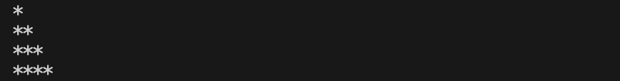
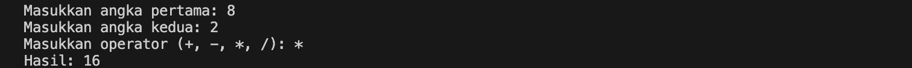

# 🧪 QA Engineer Bootcamp – Digital Skola
This repository showcases my learning progress from **Sessions 2 – 5** of the **QA Engineer Bootcamp** at **Digital Skola**.  
Each session focuses on a different aspect of software testing — blending theory with hands-on exercises.

---

### 🧩 Overview
This project includes fundamentals of **manual QA documentation** and **JavaScript programming**, continuing with **Git practice** to manage version control.  
The goal is to strengthen QA foundations through structured exercises that simulate real-world QA workflows.

---

### 📘 Contents
**Task 2:** Test documentation — including **Test Plan, Test Case, and Bug Report** for the [SauceDemo](https://www.saucedemo.com/) website.  

**Task 3:** Practiced **JavaScript Fundamentals** by generating simple console outputs such as right-triangle patterns using `for` loops.

**Task 4:** Explored **JavaScript Advanced** concepts by creating a simple calculator function for basic arithmetic operations.

**Task 5:** Applied **Git version control** — initializing repositories, committing code, branching, merging, and pushing updates to GitHub.

---

### 🧭 How to Open the Project Folders
Depending on the file type, here’s how you can explore each session’s work:

#### 💻 For JavaScript Files
You can open these files with your favorite code editor, such as:
- Visual Studio Code  
- Sublime Text  
- Atom  

To open a folder directly in **VS Code**, use:
```bash
code folder-name
```

💡 Make sure VS Code is installed and added to your system PATH.

#### 📄 For Word, Excel, or Online Files

Use the appropriate app depending on where you're opening it from:

- Microsoft Word (.docx) → open using Microsoft Word or Google Docs

- Microsoft Excel (.xlsx) → open using Microsoft Excel or Google Sheets

You can simply double-click the file, or right-click → Open With… → choose the correct app or upload it to your Google Drive to open it online.

💡 Opening via Google Docs/Sheets is handy if you don't have Microsoft Office installed — just drag the file into Google Drive, and it'll open automatically.

---

### 📂 Folder Structure
```
learningGit/
│
├── images/
│   ├── sesi3_output.png
│   └── sesi4_calculator.png
│
├── sesi2_putristphn/
│   ├── Putristphn - Test Case and Bug Report - SauceDemo.xlsx
│   ├── Putristphn - Test Plan - SauceDemo.docx
│
├── sesi3_putristphn/
│   └── sesi3_putri.js
│
├── sesi4_putristphn/
│   ├── menu.js
│   └── rumus.js
│
└── README.md
```

📝 Notes:

- Ensure you have VS Code, Word, or Excel installed before opening the files — or open them directly in Google Docs/Sheets.

- Keep the folder structure intact when submitting assignments.

- Each session reflects my progress as a QA Engineer — learning to plan, test, document, and write code to support automation in real-world projects.

---

### 📸 Preview & Output Examples
Here are some examples of what you’ll find inside this repository 👇

#### 🧩 Session 3 – Triangle Pattern Output
Example console output from `sesi3_putri.js`:



#### 🧮 Session 4 – Simple Calculator Function
Example usage and result from `menu.js` and `rumus.js`:



---

## 💡 Key Learnings

- Understanding the importance of clear **QA documentation**  
- Writing and executing **JavaScript scripts** for simple logic and validation  
- Applying **Git workflow** for collaboration and repository management  

---

### 👩🏻‍💻 Author

**Putri Stephanie Lesilolo**  
*Quality Assurance Engineer*  
📍 Jakarta, Indonesia  

🔗 [LinkedIn](https://www.linkedin.com/in/putrilesilolo/) | [GitHub](https://github.com/putristphn)


